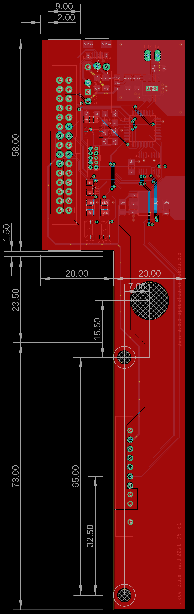

## Hotplate Blade Head 

This circuit is integrated on the toolchanger, it contains hardware to actuate a standard servo and connects to [OSAP](https://gitlab.cba.mit.edu/jakeread/osap) systems over the [UCBus](https://gitlab.cba.mit.edu/jakeread/ucbus) PHY. 

An eagle project is here in this folder... 

 