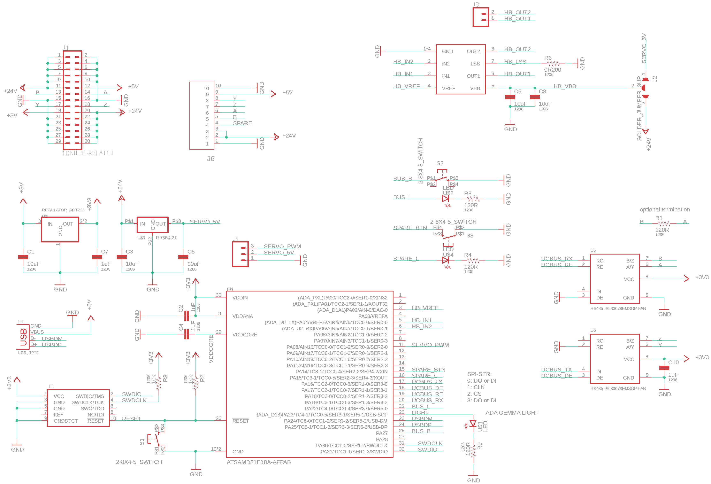
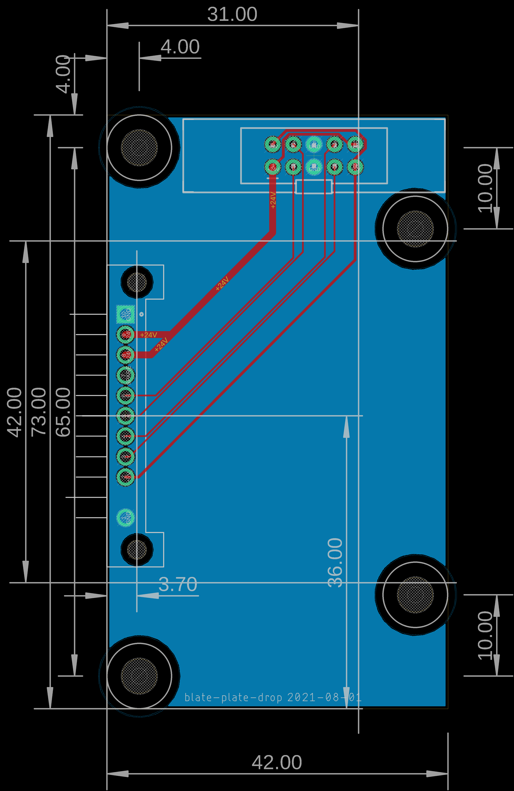
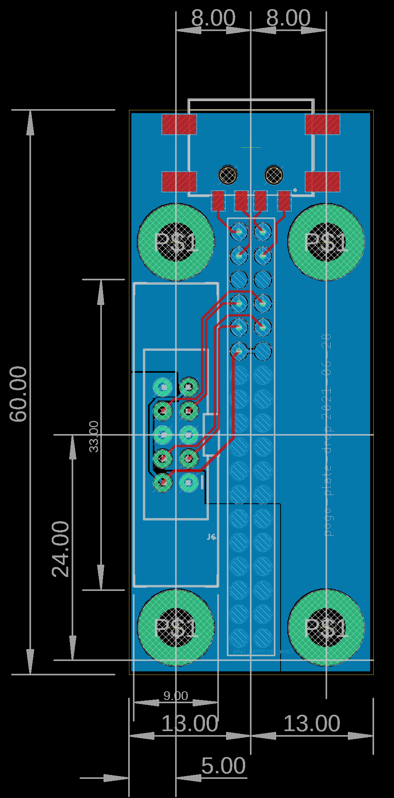

# Hotplate / Swap Log

### Revision;

- proper support for the upper section of the circuit
- lower clamp on the 30-pin connector needs a pinch more space in here 
- circuit down-select for h-bridge or servo drive, 
    - circuit should have better silk, my dude 
- open / close button needs love, it's aweful to push 
    - put a plastic part to click, into the hotplate 

## 2022 01 02 

I'm going to try to revise the circuit tonight, knock it off of the list. Components all on one side, bigger buttons... maybe a through-usb option? 

Yeah, added some USB conn, size is overall the same ish, good buttons now though. Needs decent silk still... 

And I had thought about presence detect. Like... failed-to-pickup-tool will be pretty common. Can do it with the bus normally, wouldn't mind a passive sensor. I'll chuck a phototransistor / led pair down.

Alright, I believe we're done here.


## 2021 12 06 

The controller doesn't really make sense as an h-bridge... if I use *all* of the current, I can nearly break the tool changer w/ the thing (when no tool to pinch) and if I don't use enough the cam sometimes doesn't make. 

So I will roll this up again as a servo output device... 

I'm also noticing: presence detect is real nice, so I should put something on here to that order... like a TOF sensor (?) or something. 

Blessed is [shawn hymel's heart](https://shawnhymel.com/1710/arduino-zero-samd21-raw-pwm-using-cmsis/) who did a write up on TCC use in the D21 w/o ASF or arduino. 

## 2021 12 04 

Next step here is a tiny h-bridge driver, to see if we can rotate the servo motor w/o the actual servo signal generation. 

Just want to be sane... have a 0R100 sense R here, A4950 chops when 10xVs = VRef, VRef is 0 - 3v3... 

`I_trip = V_ref / (10 * R_s)`

So with 0R100 we just have V_ref / 1, noice, so top dog is 3.3A: probably a lot. Will I blow this motor up? Maybe. 

Working OK w/ the h-bridge, though it's unclear to me if this is the move... I am whacking the thing pretty hard when there's no tool present, have cracked one part. 

- try this on the grey TC, should work OK right 
- bedone, do tool state in the VM / etc 

## 2021 08 28

I think it's basically there but I want to address one last nagging issue, which is that the two lower-left BHCS are just not quite far enough apart: we end up contacting the dowel here somewhere shy of 45' off each end, making the Z direction pretty weak as far as kinematic-ness goes. So I'm tempted to use SHCS here and hit them on the head, as these BHCS are relatively shallow semispherical surfaces. I think also the cam-contacting dowel should squish right a bit, increasing preload. 

I had also thought about moving the whole cam assembly to the right a bit, and though it'd be rad to have the authority way out there, I think this compromise is the right one and I would otherwise be chasing my tail around infinitely. It should be tuning now. 

The CAD shows me that actually BHCS, just better separated, will do better than SHCS here (which would make a smaller contact patch: edge on cylinder)... 

Alright! I think this should help, have just massaged the contact patches. Won't have to re-print the main body, just tool body. Chill. 

## 2021 08 01 

Alright we're drawing circuits today I think. 

Ah yeah I had meant to test the str8-to-DC drive for the servo before re-designing this thing... could also throw *both* on, gddng, to test / have alternates, simplify the circuit later on. 

- add h-bridge here, DAC'd  
- use vsel to send 5v from reg to h-bridge or str8 24v 
- pick conn pinout
- add thru for BHCS landing ? 
- in order to route, sneak 'em all behind ? 

I'm not totally sure how to float this while still retaining a solid enough mount at the ribbon cable. I suspect some printed 'rim mount' lip that just kisses the edges to prevent it from moving in XY but leaves it free in Z is the move... so I should shimmy the conn in a little bit on the lefthand side to allow for that, flip the rest of the components and cut a pocket below to release them. 

OK a bit tricky and for sure not very elegant... but it'll probably do for now. I'll simplify this anyways when I figure out if DC driving the servo works, that should clear up a fair amount of the mess. 

Awh, missed the wider opening in the template, will re print... 

OK and am done w/ the template circuit for the end effector. 







Alright and I'm assembling this revised hardware, hopefully just a few minors:

- flip the pushrod-at-cam bolt: hex insert in front, thicknesses flipped... should mirror inserts for bearing insert 

That's fine, I've altered some thicknesses but won't flip the part - doing so would unfavourably load torque thru the bottom of the cam / clamp, rather than directly thru the top bit. All good, thing should work, will wait to test w/ the dummy tool that's printing now, should be done otherwise.

Testing this now, it's rad - holds well, coarse alignment feels pretty good (will have to test w/ the blade conn), might add another 0.1mm preload, but it's solid and the M5 FHCS as a contact patch is awesome. 


## 2021 07 31 

Damn what, where did 11 days go? 

Assembling this thing, might want to open to larger bearing. Some other notes.

- BB30 bearing ?
- bearing clamp thickness should be on-spec for some bolt, right now it's like 13mm 
- rotary cam part needs chamfer on M3 Nylocks, was pretty uggo print 
- similarely, rotary cam part screw lengths ... was that 25 ? should be +1mm clearance 
- 4mm aluminum spacers in the tie rod should have ++ 0.1mm on diameter
- swinging arm needs a little more space on the top
- pushrod-to-servo also needs more careful clearance: FHCS is protruding here 
- circuit floater should float more: do 2x length, might have to increase spread 
- opening thru bottom of template for hex head to pass is just undersize, do ++ 0.5mm 

Alright the operation seems slick at first glance but there's a looseness in the final DOF, thing kind of rotates around the left pin. 

I can tune this by rotating the rear-three planar BHCS on the plate, but I it's still possible to pull the thing in this rotary DOF - it's stiff-ish, but not as solid as I'd like.

I think some of this *is* a rotation along Z of the cam bearing, so I should move to the BB30 bearing. I think there's also a fine tuning of the cam geometry... right now it looks like the tool is sitting a little lower on the cam than the CAD models... yeah I think it's totally riding right in the middle of the thing. Ah yeah it's even kind of visible in the CAD, I mucked this up. 

So I guess the move is to try one small print just w/ the update to the cam itself, then a larger update. 

Alright then, for the larger update - there's a list of small deltas there but I aught to think carefully about this larger bearing / overall architecture of the thing. The coarse alignment seems to be working well enough here though it'd probably benefit from an even bigger chamfer / like a 45' entry at the corners of this cutout - but the blade conn. makes it hard to be sure about this until I have PCBs. 

In all honesty the current revision feels pretty solid. I think better grip on the bearing is the biggest what-if, the flex I'm seeing I think arises from the large unsupported center section of the part, right on the left edge of the bearing: that flexes. So one easy win is to add a mounting bolt right here that secures into whatever (presumably stiffish) thing that's behind this device. 

Some of my fantasies involve really meshing this part w/ the X carriage on -fxy, I think it's totally manageable with enough cajoling, though I might have to add some z offset (dropping the lower edge ~ 10mm, not a huge loss by any means, esp. with the win in distance-from-beam of the ee's weight). At any rate that can come later with some "v2" - I've to get this thing out the door, primarily. 

The move to the BB30 bearing (42x30x7) pushes the center of the cam in 5mm only, ibid on the center pin in the tool, it's not so much for what is potentially a big win on cam stiffness. 

So I'll try it: it also help anneal the BOM, which is always tite. 

Alright I was wrong about moving the pin in 5mm, needs to come in 10 since the edge of the cam tracks the interior edge of the bearing, not the centerline. 

A more substantial departure would see a pull-pull cable drive into the rotary element, relocating the servo to 'wherever' but adding a fair amount of complexity - I could win some thickness this way but it's not likely to be worth it. As it stands I'll probably not be able to fit much down this thin section between the pin and the left constraints, so it's weighing the stiffness advantage of the big cam against that 10mm loss in interior width. 

I suspect that the stiffness wins, that might just be my favouring a kind of bulky clank as opposed to very-tiny print-head only toolchangers. I'm going to carry on w/ the update to humour myself, I'll wind up with two prototypes to evaluate between. 

Of course the issue w/ the larger bearing is that the cam arm is now ~ 29mm in radius, where the servo swings ~ 25mm, so I don't get a full 90' from a full 90' of the servo rotation... It's pretty close but for sure doesn't let me over-extend those few degrees to get it past the cam apogee. 

Ok with some cajoling I've the cam rotating just a little past apogee, that should be all it needs. So then it's just a bunch of little fitment things to sort. 

The earlier little modification to the cam profile has helped a great deal on the small-bearing proto. Nice. Very difficult to pry apart. 

I'm close w/ this large bearing revision, though I wonder if I can pull the edge out ~ 5mm by eliminating some of the far-edge bearing constraint. Moving this edge out to the right also shortens the moment arm when the thing gets pulled forwards, meaning same force = more load against the pin. 45mm -> 35mm is like 50%, so I should maybe be more considerate of that... again, all a balancing act. I aught to also consider that the printed cam is going to wear in, probably loosening over time... so I should stick a metal contact in there. 

New pushrod / space nearly worked out, just want to get the inserts right. 

Sticking a dowel in this part is a bit of a trick, the cant of the thing means I need to stick the cam out a little bit into the template face, don't really want to see that though. I could minimize this by using i.e. one of these M3 spacers, or something a little more common: maybe an 18-8 M3 SHCS that's not completely threaded? I'm also worried about securing this thing into the cam, and also about keeping decent tension thru to the back side of the bearing around this location. 

Let's see

- should be different materials
- don't want to extend the cam too far 
- want to secure the pin
- want to secure the cam to bearing around this location 

I think an aluminum bit that gets pressed into the cam and is then secured w/ the thru-M3 FHCS makes sense. It's not incredibly pretty, and does poke through the plate a little bit... at this point I think I just aught to test this mf. 

Now here's maybe the trick; I just use the bottom face of a gshdrn M4 FHCS as the contact element. Then the face stays flush & under the surface of the tool plate, I get good tension thru this side of the bearing race, it's a common AF part, etc. Nice. Bingo bango, etc. Feels like one of those things that's obvious in hindsight. 

OK, setup... now just a new template... and I think I'm done? So it's fab city and then a test... then circuits. 

## 2021 07 20

Alright I think I'm getting through details and then into the circuit design today. I've the thing cored out now - need to just get to a prototype and test, totally not sure this cam is the move. 

Then I need a good spot to lay down the right side planar BHCS. 

I wouldn't be shocked if I decide that I want the big bearing, say f-it on the width (that the middle grip is just... in the middle), and make the thing stiff as is possible... 

So this BHCS... could do the pseudo-kinematic and throw two BHCS on this right side. I don't like using the cam as a constraint since the bearing isn't so solid. Given the position of the cam pushrod arm though, there's not really anywhere to lay a BHCS down that isn't wildly biased to one / the other side. 

Yeah maybe... clamp way left, put the BHCS way to the right of it. I'm taking some mid-span space here, but the kind of benefits maybe outweigh? 

OK - here we go, I have the cam shunted into the middle of the thing, then I'm going to invert my cam-bearing-cap so that more of the top surface of the plate is planar w/ itself / monlithic in one print... and I should be able to reach the last BHCS way around the other side of that cam. 


So this will be tite if it works: I win ~ 3.5mm on width in the x carriage *and* find a bonus 10mm width on the tool, for an 80mm plate. And I tighten up the depth, so that I can run clear rails on -stretch. 

 

So I think the next step is to work the circuit in... that's a whole other thing. Ah - I have an interference issue on the pushrod. Resolved. Lots of fiddling here. 

So - the circuit... and coarse alignment. 

This might be wicked simple. I'm going to collect connector CAD models and make some dummy circuits to see how I do on coarse alignment... I am currently not planning on floating either connector: that's probably where the complexity comes and it might bite me. It might actually not be that hard to float this section though... 

Here's an alignment, joint separated but you can see how it merges:


The mating circuit sticks *in* to the tool template a bit much, about 5mm, but I think it's alright... considering whatever circuit will have components on top, might be nice. 

Moving things along, I think this coarse alignment is *fine* and the best way to know is to build it and test. I just have one more thing: to see if I can float the circuit. Then I'll have to draw those two circuits, finish the detail for the rest of the circuit mount... (how to float the conn but mount the 30pin well?) and build some of these. 

OK we have a floater: 

 

Seems sound... not really in the load path for other stuff. I'm exporting some CAD now... I need to do circuits next. 

Parts again are:

| part | PN | TE PN |
| --- | --- | --- |
| 10 pin 2.5mm blade | A114780-ND | 1123684-7 |
| 10 pin 2.5mm socket | A119250-ND | 1-1674231-1 |

Started on that, lots of other work to do - will print some stuff, try it out, and return. 

- replace bhcs push probe 
- test mechanical
- test DC drive to servo
- test D21 schem / bus integration 
- do circuit / integration, test hotswap, etc 

## 2021 07 19 

... back from haystack, want this to be done: thinking new circuit, slightly updated design is today. 

Here's my notes from haystack:

- make a wider BHCS planar stance; things are too tippy, should maximize the distance of these things as much as possible: top left can move up, that straggler on the right is awkward... do something (?)
- also top / bottom pins can move to the edges, why not right? 
- tune back the protruding dowel-pin 3dp mass, not necessary
- use advantage lever arm to move actuator further in-plane, freeing pin location constraint and z-travel on stretch 
- think about tilting angles in a tad, more perp-to-plane force 
- consider making the thing a bit wider overall?
- ofc. add the electrical connect, this is key 
- a 'uniform' tool-putdown-post would definitely be tite - then you could also easily swap tools into a machine: maybe a left-side-is-circuit-and-mountup design language is the move (?) the extra width necessary / wonderful for this 

Now today... 

- left side circuit, one side should float in z-dir (perp to blades).
- circuit mount to pinch device might be a trick
- might need reversed connector, check PNs,
- probably want thru-hole socket side, check PNs 
- what of USB connections ? 

Alright! Getting to it. 

This is a relatively big change, I might restart the initial sketch... which has remnants of wanting to be some fixed size phenolic. 

I've a lot engrained in this also. I shouldn't forget what I'm really working for:

- new, wider stance overall
- *coarse alignment* this is critical - want to whack 'em on by hand 
- the circuit - the circuit ! 

I think I could do coarse alignment with some wings on the tool plate above / below the dowel pin wings. The blade connectors I have make between 4 and 0mm, so I need coarse alignment that works around 5mm - has these things lined up to ~ 0.5mm total deviation from center. 

I have also this USB desire that I aught to pay attention to - lots of work wants cameras. I can of course just add wiring looms to those - the extruder will get one anyways for filament, etc - but it'd be great to keep it in the conn. 

I could modify the pinout to add dm/dp and a separate usb gnd, deleting extra current, but I think the 5v should be separate anyways and I also think the usb might use this line to detect things (?) somehow. Seems messy. 

```
1   gnd
2   24v 
3   5v
4   usbgnd
5   usbdm
6   usbdp
7   a 
8   b 
9   y 
10  z
```

So that'd have to be another connector entirely. If I can get these boards to make face-to-face, I might be able to just sneak in some pogo conn. However, these blads mount 90' to one another. 

I could revisit this idea of a board-edge connector, those are mostly PCIE spec, those would have to be angled to make the connector - or cut a horizontal slice through the tool changer, not ideal. 

Better to find 90' pogo connectors, of course. I can add that in later on. Pogo are solid for this anyways, that's no more than 1amp. 

So to keep the side-mounted ee board, I'll need to fit a flat-mounted connector on the hotplate itself. Since I'm thinning out the mechanism, I might find myself SOL on depth in the plate... I should see about resolving that mechanism in CAD first, then move on to the circuit specifics. 

Yep, indeed the servo horn punches through the front surface of the main body; 


Given that this is here... and that the pinching arm ends up rotating in to the face when the things get dumped, it might actually be the move to recess the mechanism in the front of the plate. I'm not totally convinced this is a great move overall.   

I'm messing around with a rotary clamp now:


This seems kind of wild but I like the idea - maybe I just have a thin-section bearing fetish. 

OK I think what I'm actually thinking about is a kind of offset cam clamp. Which I suppose is what we're looking at above... I think the difficulty is in making enough clearance for the tool to escape. And I am now thinking of slicing some section of the right-side toolplate away to make some room for the surface of this mechanism, feels like a bit of a slippery slope. 

But I think the notion of an offset cam is appropriate, and seems like it could be made fairly stiff, so I'll mess about. 

Yeah - I can totally get a cam in here - looks kinda rad:


This is in the 'locked' position, when it rotates that angled face appears - that's at 30' to allow the tool to slide out. This is altogether too wide now and I don't have a good way to actuate the thing. The effect is basically that I get a ~ 1mm lever arm on the clamping side. This is why cams are so rad... one end of the leverage can approach 0, so the leverage being like `leverArm / centerOffset` can go to infinity. 

Rotating that with a servo, though, I'd have to use another 90' of travel on the servo... all of these things can be arranged: I need to figure how to make the cam a little less side-pokey-outey. 

First, the bearing: I've picked the 6806 at the moment: the BB30 bearing: 30mm ID / 42mm OD / 7mm thick. There do exist 6804 at 20x32x7mm - those might be it. Bless us, they're used in some bicycle hubs so they're pretty widely available. Then I anticipate moving the thing in somewhat and shifting the right-side pinch location... IDK if this will all work out. 

If I don't *mind* bringing the central pin in pretty far I can even tighten the whole thing up by about ~ 14mm, for the same tool width? But is it really the same tool width? 


Then I need to reach a servo arm out of the thing... ideally it would be about the same length as the control arm on the servo, then 90' is 90' - but that arm is ~ 24mm and the *ID* of my bearing is 20mm... So I'm in a pickle again. 

That might mean I need to open up the bearing a bit more and then simply stick the control rod through the same ID as the cam is in. 

This is a total pain, I can maybe squeeze the pushrod in the back - or perhaps the pushrod aught to be a printed bit, not these off the shelf components - then I can make it nice and flat. It's under tension at load... so buckling not a worry, unless undoing jams the thing. 

I'm also kidding myself that this wheel is not going to be in the way of end effector bits... 

Ah - well - to sort the actuation, I think I just need to get a little wierd with the bearing grip... and I can go back to the 20mm ID. Servo will have to go a bit past 90' - that's fine. Will use fusion linkages etc to work out specifics. 

OK I'm cammed up:


This seems like it'll move pretty well... So I think it's just pushrod detail, body cutout for the rod, and nuts & bolts, and a dummy toolplate - then I can test this bb. 

OK my solitary qualm with this is that I can't close the structural loop to the bearing seat on the right hand side, I could mod the standing angle of the cam to bring it closer in / close that out, at the expense of loosing some loop on the left side of the bearing, where it's under the most pull-out load... OK, adjusted it. Details tomorrow, kind of satisfied with this, will see if it really feels like it performs better. 

## 2021 07 08 

Zach made a good point today: the pogos don't guarantee that GND makes before others, which is probably important - and my also-lacking coarse alignment means that system-borking errors are kind of likely w/ the pogo connector. 

So, enter blade connectors: battery connectors. I'm trying to find some now on DigiKey: these are higher current and more robust than pogo pins - and *alot* cheaper to boot. Looks like best I can do is 10 contacts at 2.5 or 2mm pitch. That would let me do something like 

```
1   gnd
2   24v 
3   24v
4   5v
5   detect (drop pulls to gnd, could be aux comm. as well) 
6   a
7   b 
8   y 
9   z 
10  gnd
```

I wish I could throw a USB-thru in the mix. These are 30v max, 7 amp per pin. If I want to future proof for skookum spindles, I need 2x 24v in there. Here's some PNs

| part | PN |
| --- | --- |
| 10 pin 2.5mm blade | A114780-ND |
| 10 pin 2.5mm socket | A119250-ND |

These are about 30mm long - pretty tite - but I think they imply a 90' mount up between the two boards. I'm going to order a few to see what's up - seems like the right direction - though I think probably one side of the mount needs to float somewhat... 

## 2021 07 06 

OK I did have one idea for a thinner lever arm behind the tool changer, where I keep the closing-lever structurally the same but tighten up the rear swingarm (to flush up against the back), then add some mechanical advantage with a second lever in the rear of the thing, like this:

 

This doesn't put any load path through weird torsion etc, I get to keep or extend mechanical advantage and package the whole device a bit better. I might win some space on -fxy but moreso it will allow me to keep top and bottom halves of the z rails on -stretch as continous bits. 

## 2021 06 28 

Back at it with the daughter board. 

Debating here if I shift the pogo a bit to the right, this would allow me to fit the daughter in a bit more straightforward location on the tool. 

Surely cleans both up, I think I'll carry on with that. 

- swap position for drop as well, -> 4mm
- clean up head board, move 5v reg to left side, consider move screws left as well 
- publish both, send to fab
    - dimensions, dimensions 
- redraw head-clamp on -fxy with upwards adjustment on pinch 
- bhcs at upper left, drop this below pin 
- use template on plunger project... 

OK boards are done, have shifted things around just a bit to hit a nicer drop board. 


Drop / daughter:




## 2021 06 26

Alright:


Still need to do a daughter for this... maybe tonight, maybe not. 

## 2021 06 25 

Working on the hotplate pogo-and-circuit today; 

- evaluate cost / benefit of servo setup here,
- should this have i.e. short-to-detect-tool presence as well ? 
- or it's a limit, as some might be passive - though this is a rare case, right? and could simply short detect w/ a little strip / piece of hardware to jumper. 
- M4 mounts, or M3 ? 

I could do a servo actuator here, for the plate - assuming we'll have one anyways, why do it twice? Maybe that's a D21 chip as well... and one of the tiny 5v regulators to power the servo. 

Yep - guess I'm doing this. That means I want the D21 footprint / schem from the stepper board... and to figure which has PWM outputs via easy-arduino, and I'll end up writing bus button-select code for that thing. 

OK so for spring contacts, I only need to buy one of these parts per machine thank god, I've got a datasheet for these [here](../datasheet/pogo-conn-823.pdf) the PN I want is:

Spring loaded contact: `823-22-032-10-002101‎`  

This does 32 positions at 0.1" spacing, two rows, through hole, initial distance is a clean 5mm (face-to-face) and maximum stroke is 1.39mm, seems like enough. 

So about the servo setup: adding that here has the benefit of also doing a passive tool-presence detect, which is helpful when i.e. on startup to determine tool state - could be super useful. Also decreases total circuit count and connector count. The alternate would be to split out the existing servo board... 

- bring D21 schem / program / bus lines / lights 
- breakout servo line / 5v reg from 24v, 
- setup touch-for-presence test 

Alright routing is going to be a bit tricky; thing is long and skinny naturally. I can't really stash the circuit parts anywhere convenient with this chosen pin-to-pin pogo layout. 

For reference here's the start;


With a circuit like;

 

This keeps things out of the way mechanically, but the stack adds up. I want the full 30 pin because I hope to put a big ol' spindle on this thing / otherwise have hefty current-hungry end effectors on the platform. 

An alternate thought would be to put this circuit about in-line with the servo, tucked between the two pins. That'd tighten the thing up a bit, but consume a decent amount of space in a kind of critical mechanical part of the tools. 

I am at this moment when I'm getting set to nail the plate design down though. I think an alignment down with the servo is certainly more 'slick' but it asks for a bit more space here on the left, pushing the overall size up. 

- could do perp-to-face in-line with servo 
- could do upper-right parallel-to-face, 
- could do upper-left parallel-to-face 

With some more thought, the perpendicular-to-face is kind of risky - the things are loading in mostly perpendicular to the face, meaning with this pinout it's not unlikely that 24v briefly touches GND. That said, I could just flip some pins to avoid that. However, it'd be nice of the make was straightforward, also for comms lines etc. 

I'd say I favour the top left, parallel layout. That's like this:


So all things considered this is the simplest place to do it. I'll see about some routing:

- extra usb lines (4) 
- tch-connect lines (2) 

Right now I'm just mirroring the plug connector in the pogo plate, though I'm breaking symmetry anyways for the USB lines - so I might as well also break symmetry on the pogo plate and line 24v up with gnd (for example). This will make it a little easier to circuit fab boards that connect to the thing, I think. 

If I do that, I need to pick where I place things before I can carry on - if I load the top with comm (RS485) and bottom with voltage, or the other way around. 

Bottom-comm makes the most sense off the bat, as when I use a small subset of voltage things will be loaded below closer to the tool... 

To route out, I'm going to take advatage of clear space to the right of the connector. 

Lots of indecision lately - if I change pinout, it makes it more difficult to i.e. have easy compatibility for swap-in-place connectors that simply touch-off on the pogo pin / or populate them with real connectors to hookup via cable. 

- pick pogo bus-thru pinout...
    - mirror conn for plug-compat ? 
    - abandon this complexity and leave off with simple bus-through connector for now?
    - second circuit does usb-thru ? 

So let's consider this. 
- I want to have this USB-thru line here, making it a little difficult to match up on *either* USB *or* some simple-bus-thru pinout... 
- circuits that tap directly into this thing are likely going to be custom end-effector circuits anyways, not general purpose devices
- I can always (and will, to start, normally) just pop this through to a cable-breakout board anyways. 
- adjusting 24v / gnd etc to group-up might actually make it easier to route single-layer end effector PCBs, right? 

So I'm going to go ahead w/ some muxed up pogo connector set that's locally appropriate and not simply matched to the bus. I suspect that *the move* is to group signals near the... top (?) of the thing, where the circuit components will lie. USB is up there anyways. 

OK last qualm with this thing is that single-sided boards milled to interface with the pogos won't really be visible. I suppose this could be fixed with a 90' pogo contact. But this also brings me full circle to the side-mount design. It's basically the same mechanical burden, allows single-sided interfaces that are maybe a bit prettier (and, like, visisble), but has this caveat (I've forgotten already) of sideways loading. But since we are going to contact in with non-bus pinout, I can massage pins to avoid big trouble during that action. 

Aaaaarbitrary / consequential decisions. This is burdened w/ my desire to set some standard that I'll be living with for some time. Since I'm cozy with double sided boards, I think the face-on plan is best, I'll stick with that. 

Last order: I wonder if any of the clank-scale end effectors are going to warrant the full 350W of 30-pin connector? A solid BLDC spindle... otherwise, I can't imagine any. Maybe biogel heaters, etc... 

None of this needs to be too serious - I have a design that's close, I'm going to finish that. I think the face-on is the move, full 30 pin power - I for sure want a wripping BLDC spindle on this thing - and the simple, skookum, big pins is the move for now. Up here it's out of the way, and despite that throwing a big headdress on the end effectors, I think that'll be effective for big effortless prototyping w/o demanding too much miniaturization of things down the line. 

Well - I've almost routed this out. 

### Completion

- route head circuit,
- test pogo-connect -> 10-pin output circuit example, 
- move upper left planar bhcs (on tool blank) a bit lower, 

## 2021 02 12

Got the VM for clank-cz running alongside this toolchanger recently:


## 2021 02 03 

Thinking about tool posts / hangups now. I suspect there's not really a good general solution and rather that each tool will have some different tool post, co-developed with the tool. Maybe some 'bolt-on' solutions exist that are well generalized, but probably each tool as a good spot to pick it up by, and we use that. 

I've ordered some parts for these previously, 

ALU tube, 3/8" OD 0.145" ID (3.63mm, ~ M4 tap)
Buna O-Rings, 9/32" OD 0.145" ID: M4 FHCS Hold-Down 

Well, here's a version, it's a bit ugly. 

 

This turns out to be asking for a much more substantial design effort than the one I want to output at the moment. I think it's the mixed approach... 'hanging them up' maybe isn't really the move: instead, having some similar planar mount on the front face of each tool might do better. 

Thing is, all of these tools are going to have different depths & heights. If it were something that could carry a substantial moment load, I could hang them on a face. Maybe like a french cleat, but I don't have the z-direction to drop off with. I could do another side of actuation - another pinching device, but I'm weary of adding more and more servos / etc here. That said, the sloppy side wouldn't have to be nearly as precise or stiff, so it might be pretty easy. Caveat that, like the tool changer itself, these shouldn't fall off when power is lost. 

After some careful consideration on the bike, I think maybe the 'forklift' type of post is actually the all around best move. 

In this case, it's the sideways forklift...

 

Think I'm done with that then, will fab a bunch of stuff and see if I can put down / pickup a tool. Next would be a loadcell / probe. 

Also had this notion:


## 2021 01 21

I'm putting this (pincher) into commission on the Clank-CZ w/ a print head, etc. One of my qualms with the current design is that it adds ~ 30mm of width to the face plate, embiggening machines which - other than always chasing the machine size : bed size ratio down - also makes it harder to have lots of tools on one pickup line. Also, while the servo is pretty torquey, it's not a constant torque source. One way to ameliorate this would be to make a custom servo controller (just a DC driver, really), but another would be to use a stepper to drive torque w/ the closed loop work I've done on those.

In any case, I figured it actually wouldn't be too difficult to set up a little push-pull control arm beneath this thing to actuate it on a cable drive a-la the beyonet from this project, previously used. 


Then this could be driven with one of these cable drives, mounted away from moving mass:


I suspect I would be able to manipulate stepper reductions / lever lengths to drive the amount of pinching force I want, and I could probably decrease the width of the swap element, as well as move it farther in-line against the x-carriage, reducing the gap between the tool and the x rail... overall, there are more free design DOF with this scheme. 

## 2020 12 27

Back at it with the tool changer, going to do revisions and try to pinch in with the X Carriage Front Plate. 

On second look, it doesn't really make sense to integrate the pinch device with the X Carriage, although it might make sense to increase the X Carriage's width to match the pinch. 

Alright, looses some space in the X direction (and Y, but less) but otherwise I think this is a fine integration to go forwards with. 


I've some hangups on the size of this thing, I'd really love for people to want to use it all over the place and 130mm of width is a lot... i.e. a prusa hotend is about 70mm across, my main struggle is squeezing a load cell across the width (they are 80mm span). That said! For things i.e. like clay plungers, I'm going to thank myself for the width. Nothing is perfect. 

I have ~ 360mm across in the current Clank CZ, meaning I need tools to be just 120mm apart to stack 3 on one machine. I would hope to do at least this many, and at the current 127mm spec, I will only fit two - sort of dissapointing. Bringing tool width down to ~ 70mm would actually be ideal then. Oy, the deliberations! If I can find a smaller loadcell this is probably a reasonable size to aim at. Yeah - these exist, god bless, I've found a 5kg cell at 55x12.7x12.7mm. 

Alright! Pinch to 70mm? I will say this feels a lot better.


Alright, goddamn, have to modify the hotend & probe now. 

## 2020 12 14 

Assembled one of these today, there's some real bugs, but it works in principle... even well. Glad I took this step away from the beyonet: it's also much faster to go together, and the overall simplicity is way lower. Should also do much better in higher performance materials, the beyonet was going to be a PITA to mill / assemble out of i.e. ALU or Phenolic. 


- interference at the lever, obvious (visible in CAD)
- the approach / pinch... at the moment seems like it needs some rotation, shouldn't 
- servo flange support goes pretty much full width 
- servo control arm interferes with x carriage plate top left roller mount ! (visible in CAD)
- servo pushrod at servo-side is a bit far back in Y+

Overall, I think it needs some well sized tweaks. I can maybe drop the servo in Z-, and mount it further out in Y- (towards the 'face' of the machine). I think, probably, there is a reasonable way to integrate the toolchanger plate with the X carriage plate, and that's likely the best option going forwards. Big trouble there is the lower flexures for the X rollers, but they might actually be out of the tool-gripper's load path... i.e. the lever's stationary mounts should be able to integrate with the XY carriage roller's flanges. But I think it's largely up to snuff. 

## 2020 12 09

Well, I'm out here at lab and ready to mill these phenolic bits for the toolchanger. 

However! Am having some second thoughts about phenolic: most of this stuff is still 3D Printed... Though I'm glad to have the design for a phenolic machine going forward, I think the move might be to stick around in 3D Printed world for this rev: want these all to be pretty accessible for machine class students, others around the world etc. That's more valuable now than the stiffness bump: and the bump can come when I do gantries etc in phenolic as well... a real effort to get there, instead of this hackney thing-in-the-middle. 

So, reasonably, I should redo these designs. I don't think It'll take very much. 

## 2020 12 06

So, at this point I've worked through a few different options - and I want to track those, so that if I ever revisit this I'll be able to recal what I did. I went through three designs, each with different merit / drawback. 

### What the Scope / Goals Were

Since I am expecting to live with these decisions for a while (I would like to design the tool changer once, but many tools in the years to come), I have taken some time with this project. 

The important things here are the same as most machine designs. (1) the thing should be stiff, as it'll be one of the first links in the structural loop wherever it's used. Given a limit of stiffness at point-contacts demanded by kinematic couplings, this basically means that the farther out I can place the point contacts from one another, the better I'll do. (2) it should be easy to make, and cheap, and ideally not require any advanced fab. I.E. if I can be in 3D Printing and CNC Milling regime, I'll be happy. (3) it should be small / low profile: I want to keep the gap from toolheads to machine axis small so that tool loads don't turn into very large torsional loads. (4) it should be easy to actuate / control, and ideally won't require systems to be on and powered up in order to keep the tool on the machine. 

### Beyonet

This has a rotary center with three ramps, very similar to a lens mount. This means it's easy to actuate, feels pretty stiff, and the mount pattern is straightforward to model / explain / build. 


I got pretty far along with this design, with a small prototype in September and having in integrated with Clank in November.

  


I liked the mechanical / actuation simplicity of this, and it looked like it could be made fairly stiff. There's a bit of a kinematic lie here: the three ramps on the beyonet (were they perfectly stiff) would have to make *perfectly* simultaneously on each button head cap. In reality, the variation in BHCS stacks is small enough, and the plastic is plastic enough, and the bearing sloppy enough, that it works - but not perfectly. 

### Axes

Once I got into actually designing a tool for the beyonet though, I noticed that having this large rotary element sticking into the center of each tool would not make for very good / easy to design end effectors. A result of this large cylindrical keep-out zone in the tool design meant that I would actually be placing tool heads (i.e. endmills, nozzles) pretty far away from the axis. 

So I got to thinking of methods that would clamp 'around' instead of 'inside' the three kinematic nobbins. Much ado aside, this is what I came up with:


It uses three tiny levers (axes, or something) each actuated with a micro servo, to kind of 'claw' on top of each BHCS in the kinematic nobbin stack. This allowed me to open up the kinematic diameter from ~ 64mm in the beyonet up to ~90mm, a huge win. 

However, it prooved awkward to design and looks complicated to build. I didn't get through assembling one: once I got into tool design again, I noticed that the topmost 'claw' meant I would be moving process axes (i.e. endmills or filament paths) out of the way of the centerline of each tool, again. 

I was also not anticipating a huge amount of retaining force with this one: small torque from tiny servos against milling forces? Probably not going to do very well. 


### Claws

What I'm doing now *I think* is a great solution. It requires a little more footwork to make good contact on the plate, but it leaves all of the tool space very clear, and should be much stiffer than both designs. 

  
  

This 'pinches' the thing in the Y direction, using a well leveraged claw on the right side of a tool plate, actuated by *one* (not three) servos - a large one. My expectation is that I can generate 300N of pinching force with this servo and a roughly 4:1 lever on the claw. 

This is also a little bit tune-able. The lower-left point of contact is between a dowel and BHCS that can be dialed out / in to adjust tramming on the XZ plane, and the three BHCS that define the planar constraint for the thing can tram in YZ, plus some rotation in XY - although they are all kind of coupled into one another. 


### Comparison 

| stat | beyonet | adze | pinch |
| --- | --- | --- | --- |
| hardpoint diameter | 64 | 90 | 90 |
| tool-face to rail | 21.25 | 31 | 40 |
| rear-race to rail | 29.75 | 25 | 31 |

### Going Forwards

For now I'll see about fabricating this pinching thing. 

## 2020 12 03

Design revs continue on this... I had expected to get through to printing by Dec 14th, and might still, but I'm re-designing the tool swap thing again, having found both the beyonet and now the 'three hammers' approach a bit cumbersome in their interference with end effector design. I want that to be really straightforward, and I want a good rigid mount, *and* this is going to lock me in on a lot of fronts, so I am trying to do it well.

I think the move for the TC is to have.. lower right holds on a tripod, so the point is locked when the thing is pinched, the upper right just holds it from rotating along the y axis, and the left keeps from rotating along the z axis... so there are total of three points of contact on the lower right, two upper right, two left, and the free (7th) degree is the clamping, so a perfect 6 contacts. 

My only qualm with this is that I might introduce some tilt when I have plates of different thicknesses. However, if I know the angles of the loading posts, I should always be able to figure out what the right size mating shape is. As for point-of-contact hardness, I could also use BHCS threaded into the side of these plates (or prints) to handle that, as has been the case. It'd be nicer to avoid threading into the sides of these plates, but it's not a big ask in real-machining land. 

BHCS in the side - I can also mill these into little pockets in a sheet of phenolic / similar milled part, and epoxy them in. So I think that's the move. I can maybe get some nuts in there as well, then I'm set up to tram-adjust the plate. 

A potentially stronger way to get the tram adjust would be to leave the bar that mounts the upper pin tuneable in X, but that would mean that same-ness in each end effector plate would need to be maintained / tool-specific tramming wouldn't be possible. 

To get fully tune-able plates, the planar (three) touch-offs on the rear of the tool plate could be BHCS mounted in each plate itself. Locking those off might be a pain, but the adjustability might be really great. Probably don't need to think about it yet, but I'll set it up to do so in the future, with specific tools, i.e. the spindle I am really going to want this for. 

I think the only struggle now is with this structure. 

Yeah, damn, it's tough. Tempted to revert to printed bits. OFC the pinch ends up wider than the other iteration, oy. 

Definitely true that doing this *without* the dowels is easier on a few counts. It's smaller, quicker to fab. But the milling. I should think about the milling... point contacts on phenolic or plastic are definitely not good enough. 


## 2020 11 20 

| part | pn |
| --- | --- |
| 6x16 Pull-Out Dowel Pin | 97355A292 |

## 2020 11 19 

Have had this up and running on a machine, the Beyonet version... now am thinking I will swap to a different design.

Adze...

Worried about:
- increased cost, although offset by not-needing cable drive (which req. tools as well)
- powerless switch? 

Cramming three small servos into this plate is no small feat. 

At this scale it's making more sense to blow the hardpoint circle up to 90mm or so from 64, and float it on a separate plate above the X Carriage. 

And then, it might actually be the move to load all three servos near the top of the thing, have all rotations in-plane with the TC face, using shoulder bolts and bronze bushings around smaller rotary ramps. 

Wonder if I should go ahead and do this in Phenolic? Want to transition the 'going' machines towards it anyways... 

So, I am working through some of these details, can compare to the beyonet design now... 


| stat | beyonet | adze |
| --- | --- | --- |
| hardpoint diameter | 64 | 90 |
| tool-face to rail | 21.25 | 31 |
| rear-race to rail | 29.75 | 25 |

The 'tool face to rail' stat is a bit misleading: while the outer edge of the beyonet allows a lower profile mount, it has this additional ~ 10mm clear space that has to be kept free, meaning that (this is why I started down this path) every tool changer will likely need a kind of emboss & mount between the hollow bolt-pattern bit and the actual tool work. If we measure from the back of the 'useable face' on both, the 'adze' actually comes out a bit better: 25mm to the rail, not 31mm. That, with the 90mm hardpoint diameter instead of 64, is a pretty huge improvement. 

So it's probably worth going forwards with this. Actuating each little hammer is a bit more involved though. 

At the moment, each of the hammers comes down vertically but I know that in the future I want to do this in sheets of phenolic, where I would lay pins and hammer-fulcrum onto the same sandwich... I am feeling like, since I'm ahead now of future machines anyways (hopefully next time I'm 'deploying' it'll all be phenolic), I should just go ahead and design this element to suit. I can pin one phenolic plate onto the X Carriage's 3D Printed part, work it back in later on. 

Then I need some real ball ends to transfer servo load to hammer load. 

OK, I think that's all of the choices made. My last question is about how to retain load... preference is to just keep those servos torqued into the thing, rather than carefully tune a bi-stable latch of any kind. 

Oddly not feeling exceptionally up for it at the moment. I could setup a servo circuit, or a heater, or loadcell amp. 

- pick a dowel, threaded 
- use 5mm phenolic (3/16 nominal) and 3mm router bit 
- do plate, and lower ears, and upper box for dowels, hinge points 
- 3dp hammers 
- place servos... 

**a servo board**
- want to depower servos (go bi-stable, turn off) 

## 2020 09 20

Assembled this, feels pretty good after fixing those silly errors from the first (frenzied) crack at it. 


So, that's rad, done for now: next I should figure if this is the right size: should cover printing and some milling, etc... I like it a bit beefy like this, I think 3D print-only folks will think it's too big. 

Otherwise, design details are about tidying screw lengths, deciding if a thru hole is worth the weight & cost of those extra bearings (it's cool AF, but am I ever going to actually route something thru there?). Then integrate it into the Clank X Carriage. 

## 2020 09 19 

Got to printing the work from the 15th last night, not before adding detailing for hardware, etc. So, assembly notes for the next round:

- deleted bearing-retaining revolve in the static body that prevented bearing insertion 
- notice that the 'back stop' also stops forward (closing) rotation. reconsider that design... can rotate the stops counter-clockwise, can also taper them so that first part of the ramp doesn't interfere with their back face 

## 2020 09 15

Perennial hotplate design revisions, this one feels good... from today: 

PID coming along, although oy, yeah, had a kind of fun idea about the toolchanger on the bike down to lab this morning. Think I might take the next 50 to jot that down in Fusion, instead of continuing with PIDs, because lab lunch is noon and it is 1110 and the whole PID thing would be an involved setup wanting more hours, whatever, on with it. 

| Bearing | ID | OD | T | $ |
| --- | --- | --- | --- | --- |
| 623 | 3 | 10 | 4 | 6 |
| 6806 | 30 | 42 | 7 | 13 |
| 6808 | 40 | 52 | 7 | 20 |
| 6810 | 50 | 65 | 7 | 25 |
| 6812 | 60 | 78 | 10 | 32 |
| 6814 | 70 | 90 | 10 | 53 |

Can't get the 30-pin IDC through the 6810, but it seems like the right bearing. The question is whether to use a cam roller that pushes / pulls a ramp perpendicular to the circle defined by the three points, or simpler tangential ramps a-la bayonet mount. What matters is that I need the thing to have high retention force. I think I can actually do better with a bayonet mount than with a cam-and-flexure thing, as in the latter all force would be transmitted through that flexural element: the bayonet can be monolithic. 

I guess I'm on this now, I'll try to finish CAD for end of day. Welp... probably won't do gt2 profiles etc, but will get the gist. 

Might make a lot of sense to do knobs with M4 hardware. Then the stack... if I *just* do 1.6mm pcb in between buttonhead and cap nut, I don't have much stiffness between the knob and the tool. Should do ~ 5mm really, and ideally that won't have to be a hard tolerance, the bayonet ramp should allow some sliding scale for success. Of course, ideally the ramp would also be a hardened surface... idk if there is a drop-in part for that. 

I was originally thinking this should work with just one bearing on the rotary bayonet, but the belt is going to exert an off-axis load... all around, I think two in angular-contact type is always better / beefier / solid, despite the cost & weight: these are each $25... the tool changer alone is about to cost $100. 

This is coming along, I'm pleased... Just needs the rotary arm - i.e. the actual bayonet, which I think is the hardest to model. 

Ooooh it's close... just some of the usual awkward nubbins. 

OK, that is *done* ... fun thing that was not meant to happen today, but glad to have it. It has a 36mm thru hole, about 116 millimeters across at its widest, 100mm diameter on the plate with 78mm circle describing the kinematic mount spacing. 


In the last two images, the rotary element is highlighted. I have still to put teeth / some other actuation on that element, and test the thing to stack up heights properly. 

A BOM,

| Part | QTY | PN |
| --- | --- | --- |
| 6810 Bearing 50x65x7 | 2 | 
| SHCS M5x10 | 6 |
| Pull-Out Dowel Pin, 8x20mm | 6 | 
| BHCS M4x10 | 3 |
| Lock Washer M4 | 3 | 95060A330 |
| Cap Nut M4 | 3 | 94000A035 |

## 2020 05 31

OK, it breathes.


The big next step is improving the clamp mechanism. As discussed yesterday, I want more pinching authority and I also want to antagonistically 'open' the thing up, to make loading easier. This should come with a design that (1) finalizes the 'ee-plate' dimension and (2) includes some coarse alignment, using that plate spec, to get the thing 'mostly' there, before the clamp makes.

## 2020 05 30

I've gone through this again, apparently not keeping notes. I'll be updating shortly in more detail for mtm / etc, but as it stands the pinching design is fairly sound, I think I've an tool-body blank that is reasonably sized for a small spindle, probe, and extruder.

My big deltas for a revised / 'final' design would be:
- needs coarse alignment mode, pre-clamp
- the cam / lock needs to also 'open' the thing up, or the resting state needs to be fairly loose: right now the push-in force is too high. this either means using the flap-flexure as is currently implemented, but 'pulling' it up with the cam, as well as locking it, or it means using a different kind of flexure entirely: here I was thinking of ahn H type of deal, mounted left, to make for more linear up-and-down movement... needs some careful thought. some appeal to making the left side entirely the 'fixed' side, and the right leaves space for the cam lever to rest in when depressed.

## 2020 04 20

The flexure on the toolchanger should be a flange at the back, on the bed. duh? Also, got a servo on the way to test this out automated. Should do a hardware rev:

- flexure 'on the bed'
- correct contact-distance errors in current model (bhcs not as modelled)
- cut-er size? 80mm across, 70?
- + thickness for the dowel inserts
- servo actuator, bistable w/ loading flexure?

## 2020 04 13

Pulling the PKM thing off of the printer, it's obvious that some more thought needs to happen around that flexure - and the wall it attaches too, which is essentially a big torsional flexure. In the DOF that is exactly meant to be constrained. This is likely easy to remedy with a thick butte, and there should be a mounting screw just beside the flexure, to prevent that twist.

## 2020 04 12

OK, now with more kinematics,


This iteration uses 5x10mm Dowels and M4 BHCS. This time is more rational, with real 6pt constraint, not my hopeful 9pt constraint... Bottom right is 3pt, left is 2, above is 2, but one DOF lost to the flexure / loading axis. Totals 6

To actuate this thing, I could use a servo, or some small cylinder like: [this McMaster part](https://www.mcmaster.com/6604k15) or [this, larger one](https://www.mcmaster.com/62245k22). These are ~ 20 and 50 lbs force respectively, or ~ 100 or 250 Newtons of force, at 100 PSI. The first is potentially enough for 3D printing heads, etc, and the latter potentially enough for KW scale small-tool spindles.

## 2020 04 09

Since C19 exile to Toronto started, one of my biggest tool desires was the single-tool-many-processes tool. Especially salient would be an easy swap between 0.8 and 0.4mm nozzles on the Prusa.

So, while I was not expecting to work on this much, I've been daydreaming about it. Sketched this today:


I'll get that on the machine soon, I think something like this is probably it. I'll also order some BHCS of varying sizes.

## 2019 03

I believe I would like to make a point about machine generalism, and a toolchanger is part of that.

I'm going to do this in a way that the 'hotplate' can swap in and out, i.e. tools will be agnostic to whether they are hotplated or just plain ol' bolted down to a kinematic mount.

Here's my nomenclature:

L0 (Machine) | L1 (Electromagnet) | L2 (Ferrous Plate) | L3 (End Effector)

Here's an image:


We can mount L3's to L0's in the same way that L2's mount to L1's, so we can remove the L1 and L2 to make purpose built (and not always-bleeding-energy) machines.


And a drawing of the interface:


For this I am planning to adapt my existing Spindle and Pen Plotter, and then add a rotary tool. The rotary tool should have children that are (1) knives or (2) pickup tools.

The hotplate is an off-the-shelf electromagnet, so far I have found [this one](https://www.amazon.com/Suction-electric-Solenoid-cylinder-Electromagnet/dp/B07JLHS8KL/) that looks suitable. I can use my DC Motor Driver to switch it on / off.

### The Click

It works, with about a 1mm wide flexure... once the steel is in contact with the electromagnet, it holds impressively well!


### Genuiniely Hot

The name 'hotplate' is fitting because the electromagnet is bleeding energy into the assembly all the time. When I run this at 24V (typical system voltage) it consumes 1.5A, so it's dissipating 36W of energy into the ALU gantry and Steel L2. After about 30 minutes this is ~ 86 deg C.

There are two things I can do, the first is to cool it down a bit. Informally, I'm going to try sticking a fan to the assembly. This should help dissipate some of those watts at a lower delta t.

I'm also planning on switching this thing with my (and Ruben's) DC Motor Driver, which has a current controller. I can regulate current to limit the heat dissipated, and could even do fancy things like hit it with more energy during a 'pulling-away' move. These are some neat tricks that might fall out of controllers if we ask them to do work while minimizing energy.

With a motor driver there, I'll want to run a fan anyways. So in conclusion: heat needs to be dealt with, but is probably not a halting issue.

### To-Do Here

 -> need to model those flexures, and know spring force
 -> finish pen plotter and themes by designing put-down location and generic ee-starter-plate.

#### The Pen Plotter
 - needs put-down nest

#### The Spindle Do-Over
 - needs put-down nest,
 - needs new pulley system

#### A Rotary Tool
 - the PNP head is a rotary insert for *the rotary* axis, a 4-th axis-facing-down for 2D ops a-la zund
 - that's going to use two bicycle bearings, probably, and a z-control step motor near the top
 - optionally mounted on springs ? ... consider this ... z-sensing is nice all around
 - small rotary (pnp, knives) is bearing - ?
 - larger rotary (wireplot, clay, etc ?) is bearing - ?

#### PNP (in rotary)
 - uses nozzles a-la sam (Luer Lock)
 - uses clippard from mcmaster 4916K23
 - and to pump https://www.amazon.com/Karlsson-Robotics-D2028-Vacuum-Pump/dp/B00DYA21PU
 - or to pump https://www.amazon.com/NW-5V-6VDC-Miniature-Vacuum-100KPa/dp/B078H8V563/

#### A Knife Tool (in rotary)
 - goes in the rotary axis, can cut things
 - rotary head should be active/passive optional ?
